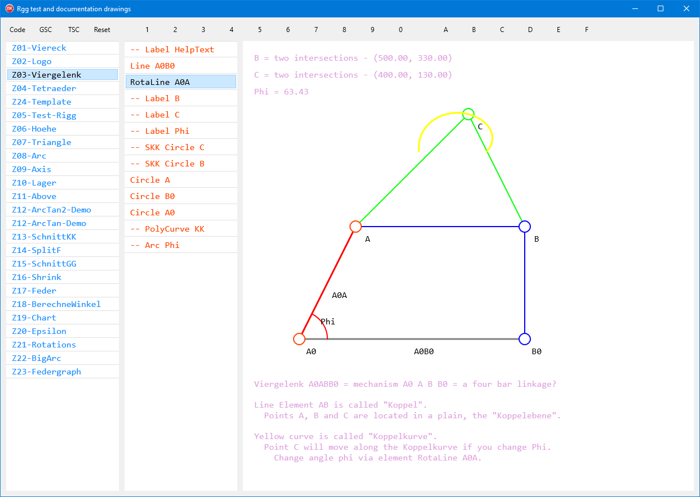

# documentation-drawings

A Delphi FMX project ( **RG79** ), consisting of:

- A dpr file.
- A dproj file for Delphi 10.2.3 Tokyo.
- A *main form* which is a generic UI for all drawings (in folder App).
- A *library unit* with drawing elements and more (in folder FD).
- A bunch of *example drawings* (in folder FZ).

Read more in the Wiki!

You should find it easy to create similar documentation drawings for your project.

Note that the project started out as a sub-project in repository [RiggVar-RG38](https://github.com/federgraph/RiggVar-RG38).
While RG38 contains the reusable code in expanded form,
RG79 has *compacted* the *library* code into just one unit.

Now we have a standalone project which can be the starting point to do more.